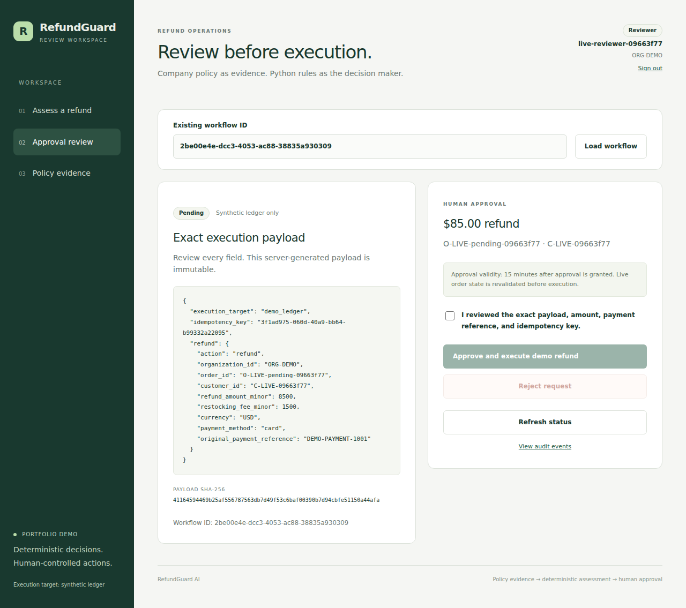

# RefundSense AI

An AI-assisted refund review demo that retrieves company policy, calculates eligibility in Python, and pauses for human approval before writing a synthetic refund ledger.

**Next.js + TypeScript · FastAPI · PostgreSQL + pgvector · LangGraph**

Archived screenshots and evaluation reports use the original RefundGuard name. Internal Python/SQL identifiers retain `refundguard` for compatibility.



## Try the demo

Requires Docker Engine/Desktop with Compose v2, Python 3.12+ and uv. Run from the repository root:

```bash
python3 scripts/setup_demo.py
```

Open http://127.0.0.1:3000. Sign in as `demo-support` or `demo-reviewer` using the generated passwords in `.local/support_password` and `.local/reviewer_password`. Setup preserves existing credentials and database records. Initial dependency/model downloads require internet access; no paid model API key is needed.

Use exact order/customer IDs, inspect the assessment and policy evidence, then review the complete execution payload as a reviewer. Seed order dates are fixed, so eligibility changes with today's date. See [Docker setup](docs/docker.md) for examples and optional experimental explanations.

[Watch the recorded walkthrough](reports/completion_v1/demo.mp4) · [Demo guide](docs/demo.md)

## How it works

- **SQL** supplies organization-scoped customer/order facts. IDs must be exact; the model cannot guess them.
- **Dense RAG** retrieves section-level policy evidence with source labels, versions, dates, hashes and line spans.
- **Deterministic Python** calculates eligibility, date windows, fees and integer-cent amounts. Optional local AI explanations select validated quotations and can abstain.
- **LangGraph** persists the approval/action workflow. The reviewer sees the exact payload and its hash before approval.
- **Execution** revalidates live SQL state and uses approval expiry, idempotency keys and atomic ledger/audit writes. It records synthetic demo refunds; no payment provider is connected.

The application has a frontend, API and database. The verification-only PostgreSQL WASM harness is separate from the deployed architecture.

## Measured evidence

| Check | Recorded result | Scope |
| --- | --- | --- |
| Dense retrieval Recall@5 | 0.75 | Original held-out split: 8 answerable questions |
| Dense retrieval MRR@5 | 0.5729 | Same frozen baseline |
| Deterministic rules | 30/30 labeled scenarios | Synthetic rules evaluation |
| Latest Python suite | 174 passed, 7 skipped | PostgreSQL WASM; native checks remain pending |
| Latest live browser suite | 6 passed | Real Next.js, FastAPI, SQL and dense retrieval; includes walkthrough recording |

The starter pack contains seven policies and 30 questions, with current/superseded policies, security cases and unanswerable questions. The original held-out split is now observed: later comparisons are regression results. No invented or estimated metrics are presented.

[Baseline results](BASELINE_RESULTS.md) · [Rules evidence](docs/rules_engine.md) · [Latest verification](COMPLETION_RESULTS.md)

Local AI explanations remain experimental with low answerable coverage. A larger model failed the predeclared development promotion gate; the default remains unchanged. Accepted gold-label quotations are not a full semantic citation-correctness measure. See [explanation results](EXPLANATION_ITERATION_RESULTS.md) and [model comparison](MODEL_COMPARISON_RESULTS.md).

Docker configuration, native PostgreSQL CI and AWS templates are prepared. Docker builds, the native database gates and GitHub Actions have not run in the editing environment. No AWS deployment has been performed. See [verification limits](docs/verification.md).

## Develop and verify

```bash
uv sync --locked --extra dev
uv run pytest -q -m 'not integration'
npm ci --prefix frontend
npm test --prefix frontend
npm run build --prefix frontend
npm run typecheck --prefix frontend
```

[Headless retrieval commands](docs/headless_baseline.md) cover parsing, ingestion and Recall@k/MRR evaluation. [Full verification](docs/verification.md) covers a disposable native PostgreSQL database, real browser tests and the explicit WASM fallback. GitHub Actions require native tests to pass with zero skips; they do not deploy or publish anything.

## Repository map

| Path | Purpose |
| --- | --- |
| `src/refundguard/` | Parsing, dense retrieval, metrics, SQL rules, approval workflow and FastAPI |
| `frontend/` | Next.js dashboard, session boundary and browser tests |
| `data/` | Original policy/evaluation pack and fixed split manifests |
| `config/` | Deterministic rules and predeclared model comparison protocol |
| `tests/` | Python unit and database integration tests |
| `scripts/` | Setup, model verification, evaluation and verification tooling |
| `reports/` | Frozen raw evidence, screenshots and walkthrough |
| `infra/` | Docker and AWS ECS/RDS/S3 templates |
| `.github/` | Pinned CI workflow and contribution templates |

[API contract](docs/api.md) · [Approval guarantees](docs/approval_workflow.md) · [Frontend](docs/frontend.md) · [AWS template](docs/aws.md)

See [CONTRIBUTING.md](CONTRIBUTING.md), [SECURITY.md](SECURITY.md) and [repository publication](docs/repository.md). A project license has not been selected; public visibility alone does not grant a reuse license.
