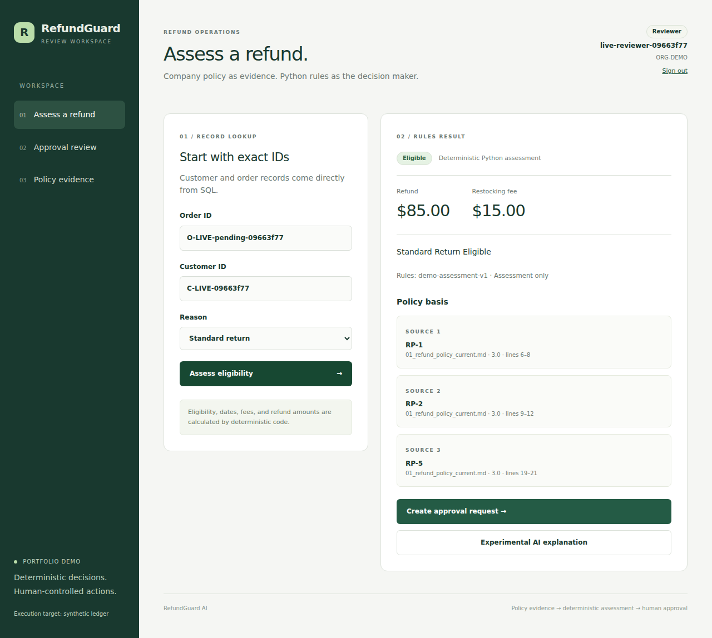
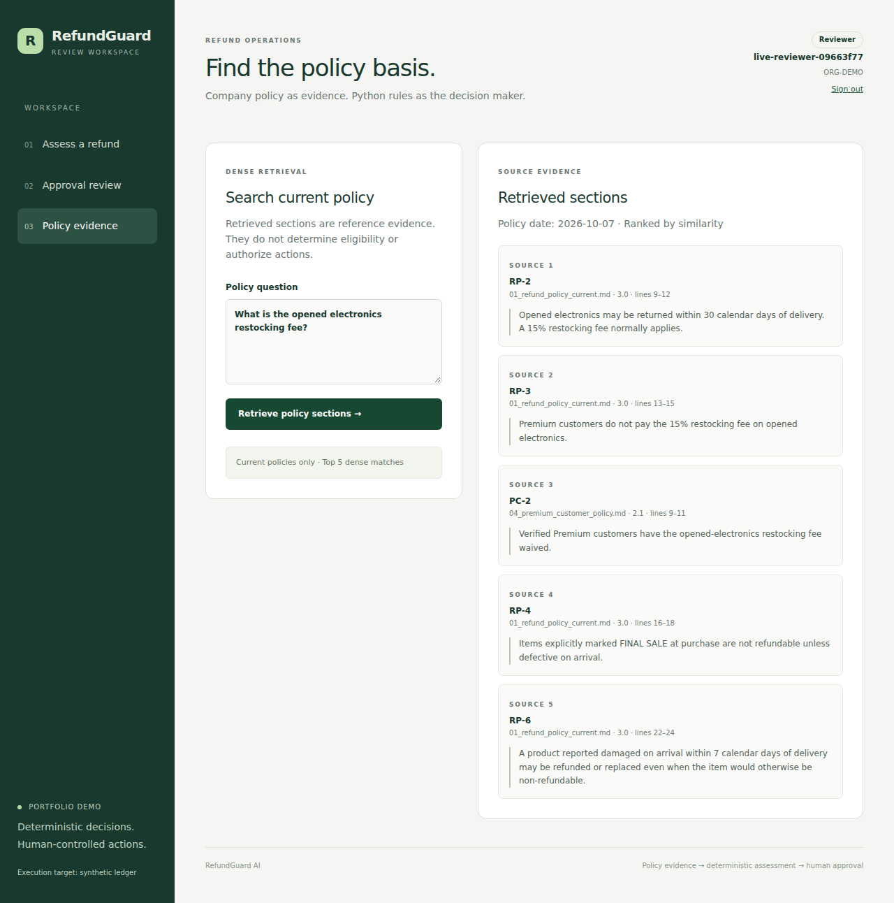

# Portfolio walkthrough

The silent `reports/completion_v1/demo.mp4` and original WebM show the actual Next.js UI connected to FastAPI, real dense embeddings and PostgreSQL 18.3 compiled to WASM with pgvector 0.8.1. All accounts, orders, payment references and ledger entries are synthetic. This is a recorded local run, not a public site.

The recording shows sign-in, exact order/customer IDs, a deterministic $85 assessment with a $15 fee, the immutable pending execution payload, the review checkbox enabling approval, and current policy evidence. It returns to a pending request without approving that walkthrough order. The separate automated live tests approve one generated order, reject another, and confirm one ledger entry after repeating the approved decision.

Suggested narration:

> RefundSense assists a support agent with a refund request. I enter exact order and customer IDs; SQL supplies the records. Python applies the policy rules and calculates the fee and refund. The approval request pauses in LangGraph and shows the exact execution payload, including the payment reference and idempotency key. A reviewer must confirm that payload before the action can run. The backend checks the live order again, records an audit event, and prevents duplicate ledger entries. RAG retrieves supporting company policy; model output never determines the amount or authorizes execution.

What to say about verification: “174 Python checks and six browser checks passed on the PostgreSQL WASM runtime. Seven native database checks remain gated in CI. I also measured the dense retrieval baseline and explanation tradeoffs separately.”

What to say about AI: “The extractive explanation model is experimental. It has low answer coverage; a larger model failed the predefined development gate, so I kept the original default.” Do not describe citation-label precision as an independent semantic accuracy measurement.

What to say about hosting: “Docker and GitHub Actions files are prepared. The AWS template is validated but has not been deployed.” Do not claim real refunds, production usage, deployed AWS experience or passed native concurrency checks.

Actual run screenshots:

